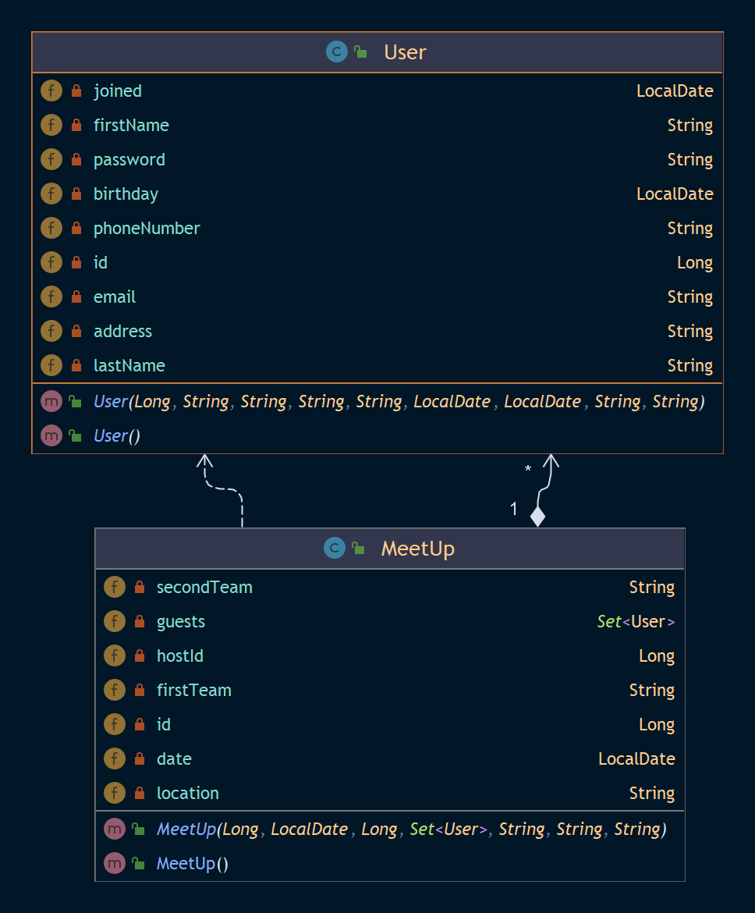

# End points available

## For users

`POST http://localhost:8080/signup` to create a user

```java
String signUp(@RequestBody User user)
```

`GET http://localhost:8080/login` to login to an account

```java
Long login(@RequestParam String email, @RequestParam String password)
```

`GET http://localhost:8080/users` to all users

```java
Collection<User> findAllUsers()
```

`GET http://localhost:8080/users/id` to get a specific user

```java
User findUser(@PathVariable Long id)
```

`DELETE http://localhost:8080/users/id` to delete a specific user

```java
boolean deleteUser(@PathVariable Long id)
```

`PUT http://localhost:8080/users/id` to edit user's infos

```java
User editUser(@PathVariable Long id, @RequestBody User user)
```

## For meetups

`GET http://localhost:8080/meetups` get all meetups

```java
Collection<MeetUp> findAllMeetUps()
```

`GET http://localhost:8080/meetups/id` get a specific meetups

```java
MeetUp findMeetUp(@PathVariable Long id)
```

`DELETE http://localhost:8080/meetups/id` delete a specific meetups

```java
void deleteMeetUp(@PathVariable Long id)
```

`POST http://localhost:8080/meetups/?hostId={id}` post a meetups with the host id

```java
void deleteMeetUp(@PathVariable Long id)
```

`PUT http://localhost:8080/meetups/id` edit a meetups

```java
MeetUp updateMeetUp(@PathVariable Long id, @RequestBody MeetUp meetUp)
```

# Launch server

```bash
 mvn spring-boot:run
```

# Database config

Go to [application.yml](./src/main/resources/application.yml) and change the databse infos

```yml
datasource:
    url: 
    username: 
    password: 
```
